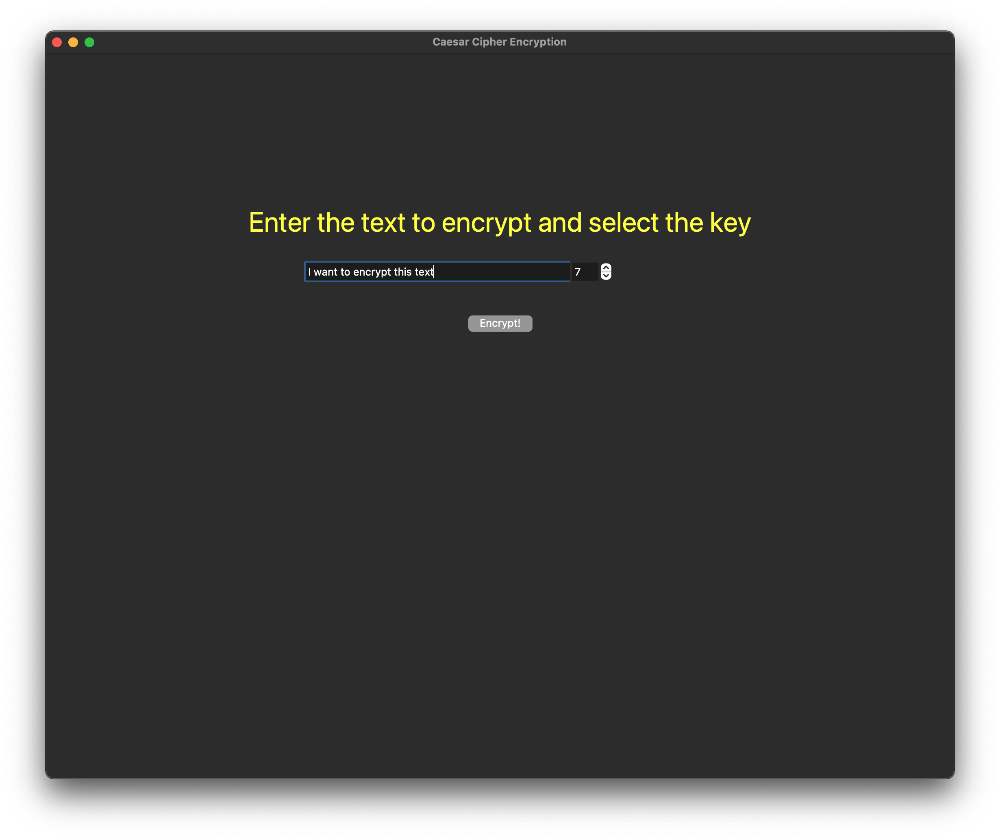
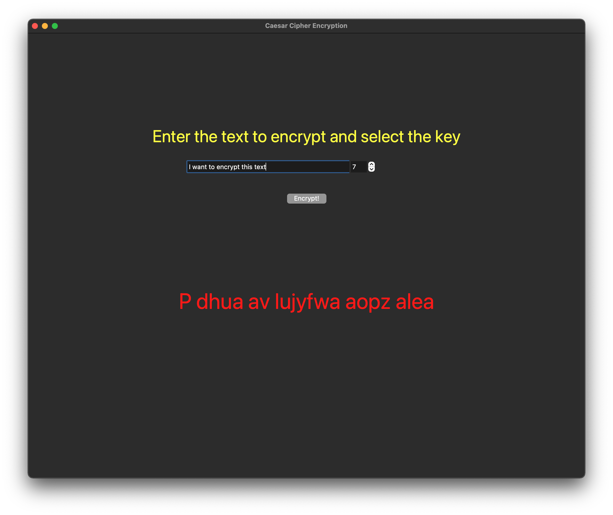

# Encrypting-Using-Caesar-Cipher
A simple GUI to encrypt a given plain text using the Caesar Cipher


### More Info
This program provides a GUI to encrypt a given plain text using the Caesar Cipher Encryption.

The user needs to provide the text and the key for encryption.

The encrypted text is automatically copied on the clipboard.

### How to run

Make sure you have Tkinter installed or install using:

```sh
pip install tk
```

Run the app using:
```sh
python3 main.py
```

### Example Usage

Enter the plaintext and key



Get the cipher text


